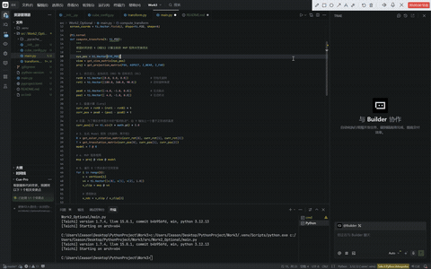

# 3D 空间坐标变换进阶实验：正方体旋转与平移插值

## 实验目标

通过本次进阶实验，你将能够：

- 深入理解 3D 空间中的坐标变换流程（MVP变换）在复杂三维几何体上的应用
- 掌握欧拉角（Euler Angles）旋转矩阵与平移（Translation）矩阵的推导与代码实现
- 理解并运用线性插值（Lerp）与三角函数实现平滑的 3D 关键帧动画效果
- 掌握工程项目的模块化解耦架构（配置参数、核心数学库、主渲染循环分离）

## 实验背景

在基础的三角形变换实验之上，我们定义了一个三维空间中的标准正方体。该正方体的中心位于原点 $(0, 0, 0)$，边长为 2。它包含：

- **8 个顶点**：坐标分布在 $[-1, 1]$ 之间（例如 $v_0$: (-1.0, -1.0, 1.0)）
- **12 条边**：通过顶点索引进行连接绘制

你需要利用 MVP 矩阵，将这个三维正方体从空间中的起始状态（位置与旋转），经过插滑平移与翻转，变换到目标状态，并在 Taichi 的 GUI 窗口中以带透视感的线框形式绘制出来。

## 实验要求

你需要构建或调用独立模块中的核心函数，返回对应的 $4 \times 4$ 齐次坐标变换矩阵，并实现插值动画：

### 1. get_euler_rotation_matrix(rx, ry, rz)

**功能**：接收绕 X、Y、Z 三个轴的旋转角度（欧拉角，角度制），返回组合后的三维旋转矩阵。

**实现要点**：
- 将三个角度分别转换为弧度：$rad = angle \times \frac{\pi}{180}$
- 分别构建绕 X 轴 ($R_x$)、Y 轴 ($R_y$)、Z 轴 ($R_z$) 的旋转矩阵
- 遵循矩阵乘法规则组合矩阵：$R = R_z @ R_y @ R_x$

### 2. get_translation_matrix(tx, ty, tz)

**功能**：接收三维空间中的位移量，返回平移矩阵。

**实现要点**：
- 在 $4 \times 4$ 单位矩阵的第四列填入对应的位移值 $(t_x, t_y, t_z, 1)$

### 3. compute_transform(t)

**功能**：接收时间参数 $t \in [0, 1]$，计算当前时刻的插值状态，并执行完整的 MVP 变换。

**实现要点**：
- 设定初始状态 $R_0, P_0$ 与目标状态 $R_1, P_1$
- 使用线性插值（Lerp）公式计算当前状态：$current = start + (end - start) \times t$
- 为 Y 轴位移叠加正弦波以实现抛物线轨迹：$y = y + \sin(t \times \pi) \times height$

## 实验提示

### 1. 动画状态机 (Ping-Pong Animation)

为了让动画能够循环播放，我们在主循环中引入了方向（`direction`）和步长（`speed`）的概念。当时间参数 $t$ 达到 1.0 时，将其方向反转；当 $t$ 回退到 0.0 时，再次反转，从而形成来回“乒乓”的动画效果。

### 2. 矩阵乘法顺序（TRS原则）

在组合模型变换矩阵（Model Matrix）时，应当遵循 **先旋转，后平移** 的原则。在右乘列向量的体系下，代码实现为：

$$Model = M_{translation} @ M_{rotation}$$

### 3. 模块化工程结构

不要将所有代码堆砌在一个文件中。我们将固定不变的顶点数据放入 `cube_config.py`，将纯数学计算放入 `transform.py`，并在 `main.py` 中仅保留渲染控制逻辑。这极大地提升了代码的可读性。

## 参考效果

程序成功运行后，会弹出一个 800x800 的 GUI 窗口，显示一个带有透视感的浅蓝色线框正方体。正方体将在屏幕中画出抛物线轨迹，并伴随复杂的三维翻滚动作。



## 环境要求

- Python 3.12+
- Taichi 1.7.4+
- NumPy

## 运行项目

由于本项目采用了包结构的模块化设计，请务必在**项目根目录**（如 `Work3` 文件夹下）作为包模块来运行代码。

```bash
# 激活你的虚拟环境（例如 uv 生成的 .venv）
.venv\Scripts\activate

# 以 Python 模块形式运行主程序
python -m src.Work2_Optional.main